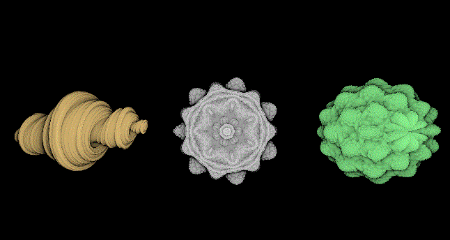

# Raymarched Fractals

Raymarched fractals based on the generic raymarcher [implementation by flafla2.](https://github.com/Flafla2/Generic-Raymarch-Unity)

SDF's were taken from ShaderToy (mostly from IQ's stuff himself, man's a legend).

Contains cheap fake AO using iteration count and Phong shading.

## SDFs Included
	Mandelbulb (static / custom power)
	Mandelbox
	Julia
	Juliabulb
	Sierpinski

# Images
## Julia, Mandelbulb and Juliabulb

## Julia

## Juliabulb

# Like my work? Consider buying me a coffee. (Click the image)

